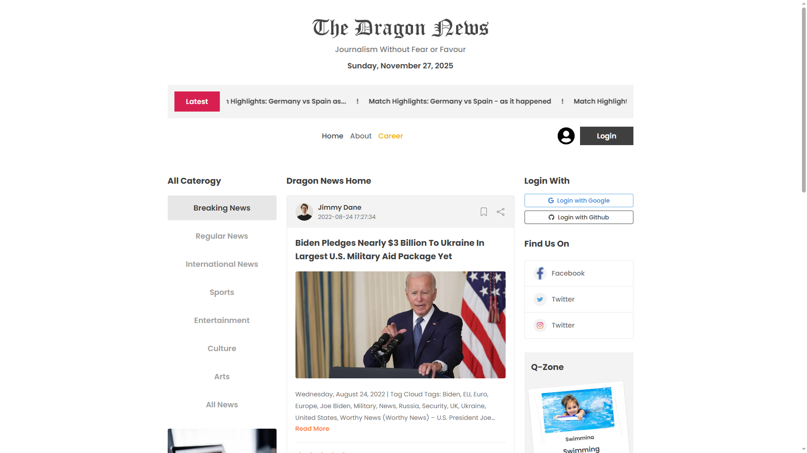
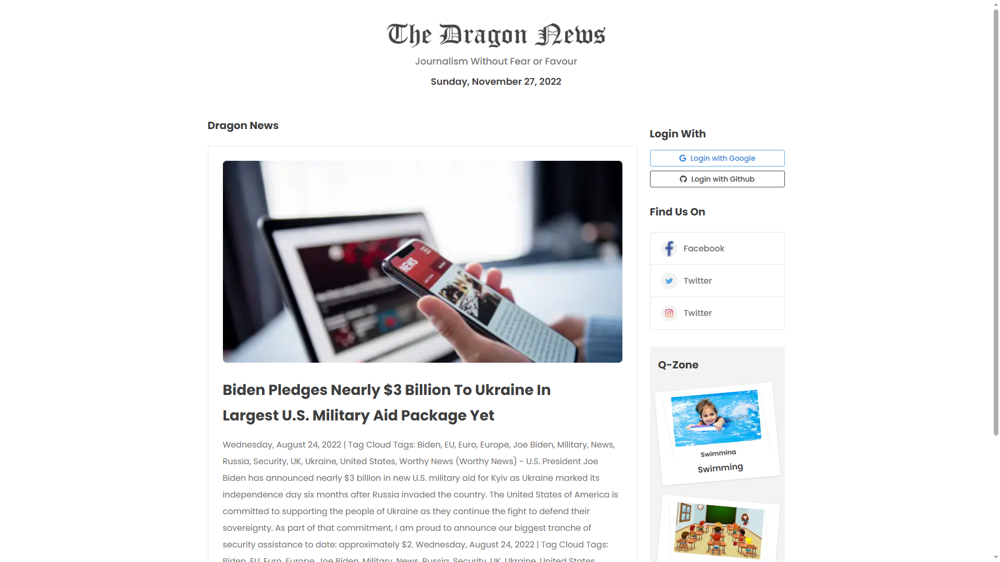

<div align="center">

# 🐉 The Dragon News

### Modern News Portal with Category Browsing and Authentication

A polished Next.js news application where readers can browse categorized news, view article details, follow latest headlines, and sign in with email, Google, or GitHub through a clean newspaper-inspired interface.

[](https://drag0n-news.vercel.app/)
[](https://nextjs.org/)
[](https://react.dev/)
[](https://tailwindcss.com/)
[](https://www.better-auth.com/)
[](https://drag0n-news.vercel.app/)

</div>

---

## 📸 Preview

<p align="center">
  
</p>

<p align="center">
  
</p>

> **🔗 Live Site:** [https://drag0n-news.vercel.app/](https://drag0n-news.vercel.app/)

---

## ✨ Features

| Feature                         | Description                                                                           |
| :------------------------------ | :------------------------------------------------------------------------------------ |
| 📰 **Category News Feed**       | Browse news by category with a three-column newspaper-style layout                    |
| 🔎 **News Detail Pages**        | Read full articles with image, metadata, author details, rating, and view count       |
| 📢 **Latest News Marquee**      | Highlight breaking headlines in a dedicated latest-news strip                         |
| 🧭 **Main Navigation**          | Navigate between Home, About, Career, category pages, and article pages               |
| 🔐 **Better Auth Login**        | Email/password authentication with Google and GitHub social sign-in support           |
| 🗂️ **MongoDB Auth Storage**     | Store authentication data using Better Auth with the MongoDB adapter                  |
| 🌐 **External News API**        | Fetch categories, category news, and article details from Programming Hero Open API   |
| 🎨 **Responsive UI**            | Desktop-first layout with responsive grid behavior for smaller screens                |
| 🧩 **Reusable Components**      | Shared header, navbar, breaking news bar, sidebars, and reusable news cards           |
| 🚀 **Vercel Deployment Ready**  | Built with Next.js App Router and optimized for Vercel hosting                        |

---

## 🛠️ Tech Stack

<div align="center">

|       Technology       |                         Purpose                         |
| :--------------------: | :------------------------------------------------------: |
|      **Next.js 16**    | App Router, routing, server rendering, and deployment    |
|      **React 19**      | Component-driven user interface                         |
|   **Tailwind CSS 4**   | Utility-first styling and responsive layouts             |
|       **DaisyUI**      | UI utility components and theme support                  |
|     **Better Auth**    | Authentication and session management                    |
|      **MongoDB 7**     | Authentication database storage                          |
| **MongoDB Adapter**    | Better Auth database adapter                             |
| **React Fast Marquee** | Latest-news scrolling headline strip                     |
|    **React Icons**     | Icon system for auth, social, rating, and UI actions     |
|     **date-fns**       | Date formatting support                                  |
|       **Vercel**       | Production deployment                                    |

</div>

---

## 📁 Project Structure

```text
dragon-news/
|-- public/
|   |-- preview1.png
|   |-- preview2.png
|   `-- *.svg
|-- src/
|   |-- app/
|   |   |-- (auth)/
|   |   |   |-- login/page.jsx
|   |   |   `-- register/page.jsx
|   |   |-- (main)/
|   |   |   |-- about-us/page.jsx
|   |   |   |-- career/page.jsx
|   |   |   |-- category/[id]/page.jsx
|   |   |   |-- news/[id]/page.jsx
|   |   |   |-- layout.jsx
|   |   |   `-- page.jsx
|   |   |-- api/auth/[...all]/route.js
|   |   |-- globals.css
|   |   `-- layout.js
|   |-- assets/
|   |   |-- bg.png
|   |   |-- class.png
|   |   |-- demo-card-thumbnail.png
|   |   |-- logo.png
|   |   |-- playground.png
|   |   |-- swimming.png
|   |   `-- social icons
|   |-- components/
|   |   |-- homepage/news/
|   |   |   |-- LeftSidebar.jsx
|   |   |   |-- NewsCard.jsx
|   |   |   `-- RightSidebar.jsx
|   |   `-- shared/
|   |       |-- BreakingNews.jsx
|   |       |-- Header.jsx
|   |       |-- MainShell.jsx
|   |       |-- Navbar.jsx
|   |       `-- NavLink.jsx
|   |-- lib/
|   |   |-- auth-client.js
|   |   |-- auth.js
|   |   `-- data.js
|   `-- proxy.js
|-- .env
|-- next.config.mjs
|-- package.json
`-- README.md
```

---

## 🎨 Design Highlights

- **Newspaper-inspired masthead** with a classic Dragon News logo and editorial tagline
- **Three-column home layout** with categories, central news feed, and discovery/sidebar widgets
- **Focused article cards** with author metadata, article image, excerpt, rating, and view count
- **Right sidebar utility area** with social login, social links, Q-Zone cards, and promotional media
- **Dedicated article/detail style about page** matching the provided reference UI
- **Clean responsive spacing** using Tailwind CSS utility classes and reusable layout components

---

## 🔌 API Overview

### Internal API

Authentication is handled by Better Auth and mounted under:

```text
/api/auth/[...all]
```

| Endpoint                  | Method      | Purpose                                      |
| :------------------------ | :---------- | :------------------------------------------- |
| `/api/auth/[...all]`      | `GET/POST`  | Better Auth session, sign-in, sign-up, OAuth |

### External News API

The news data is loaded from:

```text
https://openapi.programming-hero.com/api
```

| Endpoint                         | Method | Purpose                                  |
| :------------------------------- | :----- | :--------------------------------------- |
| `/news/categories`               | `GET`  | Fetch all available news categories      |
| `/news/category/{category_id}`   | `GET`  | Fetch all news for a selected category   |
| `/news/{news_id}`                | `GET`  | Fetch details for a single news article  |

Example category request:

```text
https://openapi.programming-hero.com/api/news/category/01
```

---

## 🔐 Environment Variables

Create a `.env` file in the project root and configure these values:

```env
# https://www.mongodb.com/products/platform/atlas-database
MONGO_URI=your_mongodb_connection_string

# https://console.cloud.google.com/apis/credentials
GOOGLE_CLIENT_ID=your_google_oauth_client_id
GOOGLE_CLIENT_SECRET=your_google_oauth_client_secret

# https://github.com/settings/developers
GITHUB_CLIENT_ID=your_github_oauth_client_id
GITHUB_CLIENT_SECRET=your_github_oauth_client_secret
# Better Auth base URL
BETTER_AUTH_URL=http://localhost:3000
```

For production, set `BETTER_AUTH_URL` to:

```env
BETTER_AUTH_URL=https://drag0n-news.vercel.app
```

> `BETTER_AUTH_SECRET` is recommended for production to avoid the default-secret warning.

---

## 🚀 Getting Started

Install dependencies:

```bash
npm install
```

Run the development server:

```bash
npm run dev
```

Build for production:

```bash
npm run build
```

Run the production server:

```bash
npm start
```

Lint the project:

```bash
npm run lint
```

---

## 🌐 Deployment

The application is deployed on **Vercel**:

**Live URL:** [https://drag0n-news.vercel.app/](https://drag0n-news.vercel.app/)

For deployment, configure the same environment variables in your Vercel project settings and update OAuth callback URLs in Google/GitHub provider dashboards.

---

<div align="center">

**⭐ If you found this project useful, consider giving it a star!**

Made with ❤️ using Next.js, React, Tailwind CSS, Better Auth, MongoDB, and Vercel

</div>
